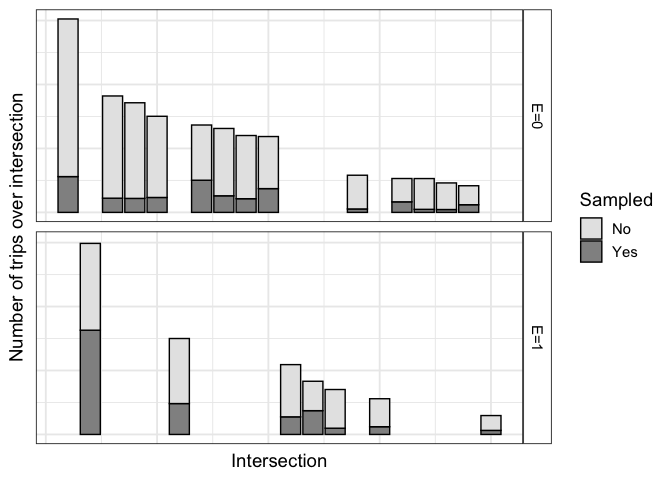

This code produces Figures 1 and 2 in the manuscript.

First, load the necessary libraries.

```r
library(tidyverse) 
library(truncnorm)
```


### Simulate data for the figure


```r
fig1_df = 1:20 %>% 
  as_tibble() %>% 
  rename(id=value) %>%
  mutate(
    l=rtruncnorm(a=3,
                 mean=20, sd=20, n=n()),
    N=rtruncnorm(a=5, mean=20 + -0.1*l, sd=20, n=n())) %>% 
  arrange(desc(N)) %>% 
  mutate(
    l_cum_right = cumsum(l),
    BD=l*N,
    l_cum_left =l_cum_right-l,
    l_cum_mid = l_cum_left+((l_cum_right-l_cum_left)/2), #because I want to plot at midpoint

    f=rbeta(n=n(),
            #more likely to be sampled if higher traffic segment and longer segment
            shape1= 15*(mean(l)+ mean(N))+100*N , 
            
            #this makes the average probability 1/4, scaled to N
            shape2= mean(l)+ mean(N) + 5*(l*100)
            ),
    N_f = N*f,
    BD_f = N_f*l,
    N_f_not = N-N_f,
    BD_f_not = BD - BD_f,
    e = rbinom(n=n(), size=1, prob=.4),
    e_char = case_when(
      e==1 ~ "E=1",
      e==0 ~ "E=0"
    )
  )


# create a long-form dataset. (Could do this with pivot-longer but not yet intuitive to me)
fig1_df_long_s1 = fig1_df %>% 
  dplyr::select(id, l, N, l_cum_mid, N_f, BD_f, e_char, e) %>% 
  rename(n_long = N_f, BD_long = BD_f) %>% 
  arrange(l) %>% 
  mutate(sampled=1) %>% 
  group_by(e) %>% 
  mutate(
    l_cum_right_alt = cumsum(l), #alt
    l_cum_left_alt =l_cum_right_alt-l,
    l_cum_mid_alt = l_cum_left_alt+((l_cum_right_alt-l_cum_left_alt)/2)
  )

fig1_df_long_s0 = fig1_df %>% 
  dplyr::select(id, l, N, l_cum_mid, N_f_not, BD_f_not, e_char, e) %>% 
  rename(n_long = N_f_not, BD_long = BD_f_not) %>% 
  arrange(l) %>% 
  mutate(sampled=0) %>% 
  group_by(e) %>% 
  mutate(
    l_cum_right_alt = cumsum(l), #alt
    l_cum_left_alt =l_cum_right_alt-l,
    l_cum_mid_alt = l_cum_left_alt+((l_cum_right_alt-l_cum_left_alt)/2)
  )


fig1_df_long = fig1_df_long_s1 %>% 
  bind_rows(fig1_df_long_s0)
```

### Figure 1: person-distance sampling at the segment level


```r
fig1_df_long %>% 
  ggplot(aes(x=l_cum_mid, y=n_long, width=l, fill =as.character(sampled))) + #set coordinate to the cumulative midpoint
  geom_bar(
    stat="identity", 
    position = "stack",
    colour = "black",
    lwd=.5) +
  facet_grid(rows = vars(e_char)) +

  ylab("Number of trips over segment") +
  xlab("Segment") +
  scale_fill_manual(
    name = "Sampled",
    labels = c(
      "No",
      "Yes"
    ),
    values = c("gray90",
               "gray57"

    )
  ) +
   theme_bw(base_size = 14)+
  theme(
    axis.ticks=element_blank(),
    axis.text.x=element_blank(),
    axis.text.y = element_blank()
    )+
  theme( strip.background =element_rect(fill="white"))+
  theme(  strip.text =element_text(colour =   "black"))
```

<!-- -->

### Figure 2: person-event sampling at the intersection level


```r
fig1_df_long %>% 
  group_by(sampled) %>%  
  arrange(desc(N)) %>% 
  mutate(new_id = row_number()) %>% 
  ungroup() %>% 
  ggplot(aes(x=new_id, y=n_long, 
             fill =as.character(sampled))) + #set coordinate to the cumulative midpoint
  geom_bar(
    stat="identity", 
    position = "stack",
    colour = "black") +
  facet_grid(rows = vars(e_char)) +
  ylab("Number of trips over intersection") +
  xlab("Intersection") +
  scale_fill_manual(
    name = "Sampled",
    labels = c(
      "No",
      "Yes"
    ),
    values = c("gray90",
               "gray57"
               
    )
  ) +
  theme_bw(base_size = 14)+
  theme(
    axis.ticks=element_blank(),
    axis.text.x=element_blank(),
    axis.text.y = element_blank()
  )+
  theme( strip.background =element_rect(fill="white"))+
  theme(  strip.text =element_text(colour =   "black"))
```

<!-- -->


